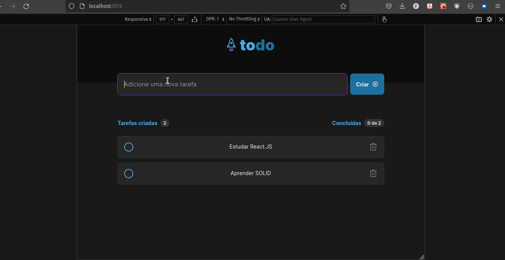

<p align="center">
    
</>
<h1 align="center">
    TO do list
</h1>

<div align="center">

  <a href="">
    
  </a>

  <a href="">
    
  </a>

  <a href="">
    
  </a>

  <a href="">
    
  </a>

</div>

<h2>📷 Preview </h2>
<h1 align="center">
  <div style="display: flex; flex-direction: row;">
    
  <div>
</h1>
To do list é um projeto para ajudar a gerenciar tarefas do dia-a-dia. Possui funções como adicionar tarefa, excluir e adicionar status de concluida 
<h2 id="technologies"> 🛠 Tecnologias utilizadas: </h2>

- [ReactJS](https://reactjs.org)
- [NodeJS](https://nodejs.org/en/)
- [Yarn](https://yarnpkg.com) or Npm
- [Git Bash](https://gitforwindows.org/)
- [Phosphor Icons](https://www.google.com/url?sa=t&rct=j&q=&esrc=s&source=web&cd=&cad=rja&uact=8&ved=2ahUKEwjFm-TeifD7AhWyr5UCHVSZA1wQFnoECBAQAQ&url=https%3A%2F%2Fphosphoricons.com%2F&usg=AOvVaw0B6_0g-qmH9oxUW4xxfnJG)
- [Typescript](typescriptlang.org/)

```bash
# Clone Repository
$ git clone https://github.com/franciniltonsoaresmenzes/ignite-feed.git

# Go to server folder
$ cd https://github.com/franciniltonsoaresmenzes/to-do.git

# Install Dependencies

$ npm install

$ npm run dev

# Access localhost
http://localhost:5173
```

<p align="center">
  Feito com 💜 by <a href="https://www.rocketseat.com.br/" >Rocketseat</a>
</p>
